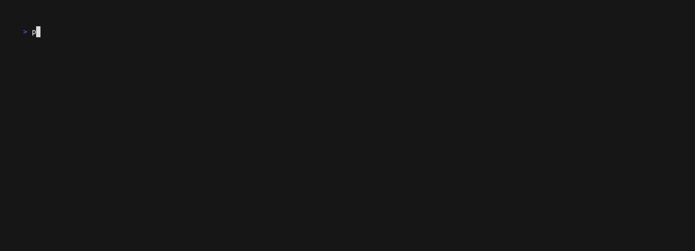

# BlenderQ

BlenderQ is a terminal UI (TUI) tool for managing a queue of local Blender renders. Add a collection of `.blend` files to a queue and monitor their progress from the terminal.

**⚠️ _Still in development!_** This is a work in progress and not yet ready for use.



## Features

- Interactive terminal interface using Ink
- Theme support
- Queue and render multiple `.blend` files
- Simple navigation and status tracking

## Prerequisites

- Node.js (v20+)
- Blender (v3.5+)
- [Nerd Fonts](https://www.nerdfonts.com/) (for the icons)

## Usage

```
Usage: program [options]

Options:
  -V, --version           output the version number
  -z, --skip-splash       Skip splash screen
  -d, --dir <dir>         Set the directory to start in
  -b, --blend <blend...>  Set the blend files to open
  -h, --help              display help for command
```

## Why Node.js instead of Python or Go?

I chose Node.js (TypeScript) primarily because it’s where my strengths lie, and I needed to quickly deliver a functional, maintainable TUI. Python and Go were attractive options, but they lacked pre-built components that matched my requirements, which would have significantly increased development time. Additionally, React-inspired design patterns in Ink made Node.js especially appealing for building clean, responsive terminal UIs. While I may explore Python in the future to integrate more directly with Blender, Node.js allowed me to efficiently ship something that works right now.

## Getting Started

Make sure you have Blender installed.

```bash
pnpm install
pnpm build
pnpm start
```

## Example

### Add a collection of .blend files to the queue

```bash
pnpm start --blend /path/to/file1.blend /path/to/file2.blend
```

### Manually search for .blend files from directory

```bash
pnpm start --dir /path/to/directory
```
